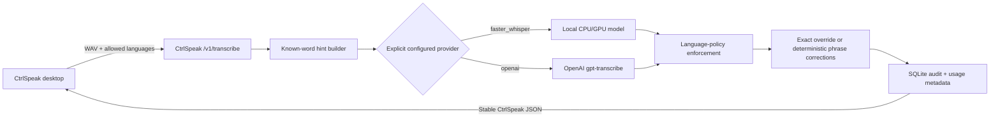

# CtrlSpeak v0.6 cloud transcription and known-words plan

Status: implementation, production deployment, and signed release complete

Baseline reviewed: `v0.5.3` on branch `v0.5`

Delivered: branch `v0.6` and stable releases `v0.6.0`, `v0.6.1`, and `v0.6.2`

Research date: 2026-08-14

## v0.6.2 routing, fast-failover, and credential follow-up

v0.6.2 makes the provider preference explicit instead of overloading the
original `resilient-quality` name. The primary published routes are:

- `ubuntu-gpu-preferred`: Ubuntu GPU → OpenAI → gateway tiny;
- `openai-preferred`: OpenAI → Ubuntu GPU → gateway tiny;
- `ubuntu-gpu-only`;
- `openai-only`; and
- `gateway-tiny-only`.

Cascading routes treat the ordered list as explicit permission to continue
after an upstream availability, credential, or quota failure while retaining
the exact cause in `attempts`. Provider-only routes do not fall through.
Compatibility aliases remain for v0.6.0/v0.6.1 clients.

Before uploading a recording to Ubuntu, the gateway uses a 500-ms health probe
with a 350-ms connection ceiling. A failure opens a 30-second circuit and later
requests bypass the worker immediately until a bounded half-open re-probe. A
five-second healthy cache avoids redundant probes while successful worker
transcriptions refresh health.

The Windows desktop now supports **Remember securely on this computer** through
the current user's Windows Credential Manager vault, loads that credential at
startup, and provides **Forget key**. The key remains excluded from
`settings.json`, logs, update metadata, gateway persistence, and worker
requests. Non-Windows builds remain session-only until a native secret-store
backend is added.

Release and deployment audit (2026-08-15): GitHub Actions run `31859974158`
completed both native builds, the full required tests, signed-manifest
generation, independent draft audit, and stable publication. A separate public
download verified the exact five-asset `v0.6.2` set. The Windows release reports
packaged/file/product version `0.6.2`, and update discovery from `0.6.1` returns
`available` for the signed Windows artifact.

The dedicated OpenStack gateway and local Ubuntu GPU worker both run service
version `0.6.2`. The gateway defaults to `ubuntu-gpu-preferred`, publishes all
five primary routes plus compatibility aliases, retained 51 correction rules
(50 enabled), and listens only on its WireGuard address. A fresh real request
used `ubuntu-gpu-large-v3-turbo`, returned non-empty English text, and reported
no degradation. Rollback copies are retained at
`/var/backups/ctrlspeak-gateway/20260815T023732Z-v0.6.1-before-v0.6.2` and
`/home/trueai/backups/ctrlspeak/20260815T024513Z-v0.6.1-before-v0.6.2`.
The Windows desktop's saved route is `ubuntu-gpu-preferred` and will become
active when the packaged update restarts CtrlSpeak.

## v0.6.1 desktop correction-submission follow-up

The v0.6.0 gateway exposed complete correction CRUD endpoints, but the desktop
shipped without a tray or management-window control that could create a phrase
rule. Automatic edit feedback was not a substitute: it submits a confirmed
whole transcript to `/v1/transcriptions/{id}/feedback`, whereas known words
require `POST /v1/corrections`.

v0.6.1 closes that gap with **Submit correction…** in the tray. The dialog:

- collects the phrase currently produced and its desired replacement;
- submits through the runtime-pinned gateway URL and bearer identity;
- defaults to a user-scoped rule, with an explicit administrator-only global
  option;
- validates empty and unchanged mappings before any network call;
- performs the request outside the Tk thread and reports success or an
  actionable API error; and
- never logs the bearer token or correction text.

Acceptance includes headless API/tray tests, a real Tk construction smoke test,
and a reversible create/read/delete transaction against the production gateway.

Release audit (2026-08-15): GitHub Actions run `31854554201` completed
successfully, including Windows and Linux builds, signed-manifest creation, and
publication. The public stable release contains exactly the two platform
binaries, `SHA256SUMS`, `update-manifest.json`, and `update-manifest.sig`.
Independent download verification accepted the complete signed `v0.6.1` set;
the Windows artifact reports packaged, file, and product version `0.6.1`. A
real discovery check using installed version `0.6.0` returned `available` for
the signed Windows `v0.6.1` artifact. The dedicated gateway and Ubuntu GPU
worker both report service version `0.6.1`; the gateway retained all 49
correction records present at deployment, and the Hermes personal-assistant
service remained active after the worker restart.

## 0. Approved implementation architecture (supersedes conflicting text below)

The original investigation sections remain as the research record. The user
subsequently approved a more capable multi-provider design. Where later
sections say one server-wide provider, no fallback, no multi-user isolation,
or server-owned OpenAI credentials, this section supersedes them.

The three runtime roles are:

1. **Desktop/client** records audio, connects only to a client-facing gateway,
   reads its capabilities, selects a published strategy, and may supply the
   user's own OpenAI key. On Windows the key may be stored in the user's native
   Credential Manager vault; it is masked, never written to settings, and sent
   only on transcription requests.
2. **Dedicated CtrlSpeak gateway** authenticates distinct client identities,
   advertises capabilities, routes providers, owns the correction/audit
   database, applies corrections exactly once, and returns provider/fallback
   metadata. It never stores a server-owner OpenAI key. The existing Nova
   instance remains only the WireGuard transport hub.
3. **Ubuntu GPU worker** is a service-to-service raw inference endpoint. It
   loads `large-v3-turbo` on CUDA/float16 and accepts only the dedicated gateway
   worker credential. It has no client `/v1/transcribe`, correction, feedback,
   or OpenAI behavior.

The default `ubuntu-gpu-preferred` gateway strategy is an ordered,
server-defined cascade:

1. `ubuntu-gpu-large-v3-turbo` over the existing WireGuard fabric;
2. `openai-gpt-transcribe`, using only the calling user's request-scoped key;
3. `nova-tiny-whisper`, loaded lazily on CPU/int8 as the emergency fallback.
   This provider ID is retained for API compatibility; the model now runs on
   the dedicated `CtrlSpeak` gateway rather than Nova.

Fallback is explicit in capabilities and every response records `provider_used`,
`attempts`, and `degraded`. A cascading strategy continues after upstream
availability, key, and quota failures while preserving the exact cause in
`attempts`; a provider-only strategy returns the provider's terminal actionable
error. `openai-preferred` reverses the first two providers, and explicit
Ubuntu-only, OpenAI-only, and gateway-tiny-only routes are also published.

`GET /v1/capabilities` lets the desktop verify that it reached a gateway and
lists the providers and strategies allowed for that authenticated principal.
Clients can choose only published provider/strategy IDs; they cannot submit an
arbitrary upstream URL.

`CTRLSPEAK_CLIENTS_JSON` maps bearer tokens to principal IDs, admin status, and
provider permissions. User correction rules, exact overrides, transcriptions,
and feedback are identity-scoped. Global rules require an administrator.
Existing rules migrate as global and existing audit/override rows migrate to
the legacy principal. Applicable opted-in rules can supply `keywords[]` to
OpenAI and vocabulary hints to the worker, but deterministic single-pass
gateway correction remains authoritative.

The implementation and deployment acceptance order is:

1. preserve the v0.5.3 database and service configuration;
2. migrate/test locally with fake providers and no paid OpenAI call;
3. deploy and verify Ubuntu in worker-only mode;
4. deploy the dedicated OpenStack `CtrlSpeak` instance in gateway mode with
   the existing client token and the dedicated worker token;
5. verify capabilities and a real gateway→WireGuard→GPU transcription;
6. verify safe failure metadata and that neither server stores an OpenAI key;
7. build, sign, publish, and test the desktop v0.6.0 update only after both
   server roles pass.

Implementation checkpoint (2026-08-14):

- branch `v0.6` contains the desktop, gateway, worker, migration, API, tests,
  version metadata, and packaging changes;
- Windows/core acceptance: 125 passed, 1 expected GUI/full-suite skip;
- local service acceptance: 19 passed;
- native Ubuntu service acceptance: 26 passed;
- `dist/CtrlSpeak.exe` built under the stable name and its packaged health
  receipt reports product `ctrlspeak`, version `0.6.0`, and `frozen: true`;
- Ubuntu is deployed and running as v0.6.0 `worker` on `10.83.233.2:8765`,
  `large-v3-turbo`, CUDA/float16; a real 20-second audio sample passed raw-only
  inference, and the pre-change source/config/database snapshot is
  `/home/trueai/backups/ctrlspeak/20260814T071000Z-v0.5.3-before-worker`;
- the complete v0.6 API documentation is deployed on the Ubuntu worker at
  `/home/trueai/services/whisper-transcription/docs/API.md` and on the
  dedicated gateway at `/opt/ctrlspeak-gateway/docs/API.md`;
- the initial Nova gateway deployment has been superseded by the dedicated
  OpenStack instance named exactly `CtrlSpeak`: Ubuntu 24.04 LTS, `m1.small`
  (1 vCPU, 2 GiB RAM), persistent 20-GiB boot volume, no floating IP, and
  private WireGuard address `10.83.233.4`;
- `CtrlSpeak` runs enabled `ctrlspeak-gateway.service` v0.6.0 on
  `10.83.233.4:8765`, holds the migrated correction/audit database, exposes
  the authenticated `resilient-quality` cascade, and stores no OpenAI key. A
  1-GiB swap file and systemd memory/CPU limits provide a bounded emergency
  CPU-fallback envelope on the 2-GiB guest;
- Nova's superseded `ctrlspeak-gateway.service` is disabled and port 8765 is
  closed. Nova itself remains active as the WireGuard hub. Its last full
  pre-migration backup is
  `/home/ubuntu/backups/ctrlspeak/20260814T175639Z-pre-dedicated-gateway-migration`;
- a real restricted-English request passed
  Windows → `CtrlSpeak` gateway → WireGuard → Ubuntu GPU → gateway, returned a
  transcription ID, and applied the migrated known-word correction layer;
- the Windows desktop settings target `http://10.83.233.4:8765`; exactly one
  `CtrlSpeak.exe` process is running and authenticated capability discovery
  reports the GPU worker ready; and
- the personal `telegrampersonal` Hermes/Homeys agent's speech adapter and
  correction client both target the dedicated gateway, its user service is
  active, and it can authenticate, see the GPU provider ready, and read back
  the migrated enabled correction inventory. Its cutover backup is
  `/home/trueai/backups/hermes/20260814T181706Z-before-dedicated-ctrlspeak`;
- annotated tag `v0.6.0` identifies deployment commit `d015bf9`. GitHub Actions
  run `31783640604` completed both clean native builds, signed-manifest
  generation, draft audit, and stable publication successfully; and
- an independent public download verified the exact five-asset release set,
  Ed25519 signature, canonical manifest, sizes, and SHA-256 values. The
  downloaded Windows binary passed its packaged health receipt, and discovery
  from simulated installed version v0.5.3 reports v0.6.0 as available without
  starting an installation.

## 1. Executive decision

CtrlSpeak v0.6 should add OpenAI's `gpt-transcribe` as a second transcription
provider behind the maintained CtrlSpeak server API. The desktop application
should continue to send audio to `POST /v1/transcribe`; it should not call
OpenAI directly and it should never contain an OpenAI API key.

The server will have an explicit provider setting:

- `faster_whisper`: the current local CPU/GPU implementation; or
- `openai`: a new provider that uploads the completed recording to OpenAI's
  `/v1/audio/transcriptions` endpoint using `gpt-transcribe`.

There will be no silent provider fallback. If OpenAI is selected and the
network, credentials, rate limit, language policy, or upstream service fails,
CtrlSpeak will return a clear error and will not quietly run the local model.
Changing provider will be an explicit configuration action followed by a
service restart.

The existing correction API is not merely a list of known spellings. It is a
deterministic phrase-replacement engine which runs after transcription. v0.6
should retain that engine, expose it more clearly as **Known words and
corrections**, and optionally use the canonical replacement phrases as OpenAI
`keywords` before transcription. OpenAI documents keywords as hints rather
than mandatory output, so deterministic post-processing remains the final
authority.

This architecture gives v0.6 one coherent flow:

1. CtrlSpeak receives and validates a recording.
2. It selects the one configured provider.
3. It builds safe, explicitly enabled recognition hints from applicable known
   words.
4. The provider produces raw text and detected-language metadata.
5. CtrlSpeak enforces the requested language policy and refuses unverifiable or
   out-of-policy results.
6. CtrlSpeak applies exact approved overrides and deterministic phrase rules.
7. It records an audit entry and returns the same stable CtrlSpeak response
   shape to the desktop.

## 2. Goals

v0.6 should:

- let an operator select local `faster-whisper` or OpenAI cloud transcription
  at the CtrlSpeak service;
- preserve the current desktop-to-CtrlSpeak API contract so existing v0.5
  clients need only small additive changes;
- keep OpenAI credentials out of the desktop executable, desktop settings,
  Git, logs, health responses, and OpenAPI documents;
- keep the current ordered output-language policy and fail closed when a cloud
  result cannot be proven to satisfy it;
- turn applicable known-word replacements into opt-in `gpt-transcribe`
  keyword hints without treating those hints as guarantees;
- preserve deterministic, auditable post-transcription correction;
- make server and embedded correction behavior understandable and, where
  practical, consistent;
- report the active provider, provider model, request usage, and safe support
  metadata without recording transcript text in application logs;
- retain temporary-audio deletion on every success and failure path;
- document the cost, privacy, networking, and operational consequences of
  choosing cloud transcription; and
- be testable without spending money in ordinary CI, with a small opt-in live
  OpenAI acceptance suite for release validation.

## 3. Non-goals

The first v0.6 release should not include:

- direct desktop-to-OpenAI requests or an OpenAI key embedded in
  `ControlSpeak.exe`;
- automatic switching between local and cloud providers;
- live microphone streaming through the OpenAI Realtime API;
- speaker diarization, meeting summaries, translation, subtitle generation, or
  word timestamps in OpenAI mode;
- fuzzy correction, phonetic guessing, edit-distance matching, or an LLM that
  freely rewrites the transcript;
- automatic conversion of whole-transcript edit feedback into global phrase
  rules;
- multi-user or tenant isolation on one CtrlSpeak server;
- indefinite retries of paid requests;
- uploads larger than OpenAI's documented file limit through automatic
  chunking; or
- removal of the local model provider.

Realtime transcription, diarization, long-file chunking, and multi-tenant rule
sets can be evaluated after the completed-file path is stable.

## 4. Current correction functionality: complete audit

### 4.1 Maintained server phrase rules

The maintained implementation is
`server/whisper_transcription/app/corrections.py`. It stores rules in the
SQLite `correction_rules` table and exposes them through:

- `POST /v1/corrections`;
- `GET /v1/corrections?enabled=true|false`;
- `GET /v1/corrections/{rule_id}`;
- `PATCH /v1/corrections/{rule_id}`; and
- `DELETE /v1/corrections/{rule_id}`.

A rule currently contains:

- `source_phrase`: what the speech model commonly returns;
- `replacement_phrase`: the exact canonical output;
- `context_terms`: optional terms which must all occur in the supplied context
  or raw transcript;
- `tags`: labels stored for administration but not used while matching;
- `enabled`;
- `priority`;
- timestamps; and
- `use_count`.

Current matching behavior is deterministic:

1. Disabled rules are excluded.
2. All context terms are case-folded and must occur as substrings of
   `context + raw_text`.
3. Candidate rules are ordered by longer source phrase first, then higher
   priority, then creation time.
4. Source matching is case-insensitive.
5. `(?<!\w)` and `(?!\w)` guards prevent a source phrase from matching inside
   a larger Unicode word.
6. Every occurrence of the phrase is replaced with the rule's literal
   replacement text.
7. Each applied rule ID is returned and its use count is incremented.

Example:

```json
{
  "source_phrase": "Acme corp",
  "replacement_phrase": "ACME Corp",
  "context_terms": [],
  "tags": ["company"],
  "enabled": true,
  "priority": 0
}
```

If the raw transcript is `hello Acme corp`, the response text becomes
`hello ACME Corp` and the rule ID appears in
`applied_correction_rule_ids`.

This is already suitable for exact company names, product names, acronyms, and
recurring phrase corrections. It is not fuzzy and it does not teach the speech
model how to recognise the phrase; it repairs the model's text afterward.

### 4.2 Confirmed edit feedback and exact overrides

The desktop's automatic edit-feedback flow is deliberately separate from
phrase rules:

1. A successful transcription returns an ID, raw text, corrected text, and an
   immutable feedback target.
2. After CtrlSpeak inserts the text, a bare Enter can snapshot the active field.
3. If the user changed the text, the desktop sends `confirmed_text` to
   `POST /v1/transcriptions/{id}/feedback`.
4. The server stores an audit record in `transcript_edit_feedback`.
5. It creates or updates an `exact_transcript_overrides` row keyed by the
   complete raw transcript.

An approved edit therefore applies again only when a future raw transcript is
exactly equal to the earlier raw transcript. Similar sentences are not broadly
rewritten. This is a sound safety boundary: one user edit cannot accidentally
be inferred as a global linguistic rule.

Exact overrides run before phrase rules. When one matches, it replaces the
whole result and phrase rules are not subsequently applied.

### 4.3 Embedded/local correction behavior

`utils/local_corrections.py` implements the same conservative whole-transcript
feedback behavior for the bundled desktop provider. Its SQLite database has:

- `local_transcriptions`;
- `local_edit_feedback`;
- `local_exact_overrides`; and
- `local_explicit_phrase_rules`.

Only exact overrides are currently applied. The explicit phrase-rule table can
be listed but has no create, update, delete, or apply implementation. This
means the maintained server and embedded provider do not currently have phrase
rule parity.

### 4.4 Desktop client behavior

`utils/transcription_backend.py` sends only the audio and, when configured,
`allowed_languages`. It does not currently:

- manage `/v1/corrections`;
- send a known-word glossary;
- send `initial_prompt`;
- send correction `context`; or
- inspect or edit exact overrides.

The management window exposes backend selection, API URL/token, feedback
capture, and output languages. It has no known-words/corrections editor.

### 4.5 Storage and audit behavior

The maintained service currently persists more than correction rules. The
`transcriptions` table stores raw text, returned text, language, segments,
context, applied rule IDs, selected request metadata, and timestamps. Confirmed
edits and exact overrides also store transcript text. These records currently
have no API retention or deletion workflow.

Temporary uploaded audio is written below the configured data directory and
deleted in a `finally` block after transcription. Audio is not deliberately
retained by the service after the request.

### 4.6 Current strengths to preserve

- Explicit CRUD rather than implicit fuzzy learning.
- Unicode-aware phrase boundaries.
- Disabled rules and explicit priority.
- Optional context gating.
- Stable rule IDs and application metadata in each response.
- Exact-only learning from user edits.
- Auditable edit provenance.
- SQLite foreign keys and WAL mode.
- User-only database permissions on Linux.
- No silent local/cloud or CPU/GPU fallback.

### 4.7 Gaps and risks to address in v0.6

1. **Rules do not help recognition.** They only rewrite text after the model
   has already selected words.
2. **Server/local asymmetry.** Phrase rules work on the maintained API server
   but not in embedded mode.
3. **No language scope.** A rule can affect every language.
4. **No cloud-hint consent.** Existing rules were created before any proposal
   to send canonical phrases to a third party.
5. **Sequential cascading is possible.** The replacement produced by one rule
   can be matched by a later rule in the same pass.
6. **Overlapping rules are under-specified.** The code has an ordering, but the
   public API documentation does not define the conflict contract.
7. **Context matching is broad.** Context terms are simple case-insensitive
   substrings and can match inside larger words.
8. **The API permits no empty replacement.** Rules cannot explicitly delete a
   phrase; this should remain intentional and documented.
9. **CRUD is not separated from transcription authorization.** Any remote
   caller holding the ordinary bearer token can list or mutate global rules.
10. **Loopback is unauthenticated.** Any process on the server host can mutate
    corrections.
11. **Feedback mutation is not one transaction.** Attaching rule feedback can
    succeed before an invalid confirmed-text approval makes the overall request
    fail.
12. **Rule feedback is not validated against application.** A caller may attach
    any existing rule ID to any transcription, even when that rule was not
    applied.
13. **Exact overrides cannot be administered.** There is no supported way to
    list, disable, or delete them without opening SQLite directly.
14. **Audit retention is indefinite.** Raw and corrected transcript text can
    accumulate on the CtrlSpeak server.
15. **Documentation is incomplete.** It shows CRUD fields but not matching,
    conflicts, persistence, privacy, or exact-override precedence.

## 5. Official OpenAI transcription findings

The following facts were verified against official OpenAI documentation on
2026-08-14. They must be rechecked immediately before implementation because
models, limits, prices, and policies can change.

### 5.1 Recommended model and endpoint

OpenAI currently recommends `gpt-transcribe` for completed recordings. It is a
high-accuracy speech-to-text model for completed files, streamed file
transcripts, and committed Realtime turns.

CtrlSpeak's existing record-then-transcribe workflow maps directly to:

```http
POST https://api.openai.com/v1/audio/transcriptions
Authorization: Bearer <server-side OpenAI API key>
Content-Type: multipart/form-data
```

The minimum useful form fields are:

- `file`: the completed audio file; and
- `model=gpt-transcribe`.

Supported documented formats are `flac`, `mp3`, `mp4`, `mpeg`, `mpga`, `m4a`,
`ogg`, `wav`, and `webm`. The file-transcription guide documents a 25 MB limit.
CtrlSpeak currently sends WAV, so format conversion is not necessary for short
voice notes.

### 5.2 Request features relevant to CtrlSpeak

`gpt-transcribe` accepts:

- `prompt`: unstructured recording context or style guidance;
- `keywords[]`: literal words or phrases expected in the recording; and
- `languages[]`: possible input languages.

The multiple `languages` field replaces the older singular `language` field
for `gpt-transcribe`; both must not be sent together. The API accepts supported
language codes and rejects unsupported or malformed values.

OpenAI explicitly describes keywords as hints, not required output. Too many
irrelevant keywords can reduce quality or make unspoken terms appear. This is
why CtrlSpeak must not treat the upstream keyword feature as its correction
engine.

OpenAI also documents these keyword restrictions: one keyword per line, with no
`<`, `>`, carriage return, or line feed. CtrlSpeak must filter or reject an
upstream hint that violates those rules while retaining the deterministic local
correction itself.

### 5.3 Response relevant to language enforcement

The normal JSON response contains:

```json
{
  "text": "Bonjour, pouvez-vous m'entendre ?",
  "languages": [{"code": "fr"}],
  "usage": {
    "type": "duration",
    "seconds": 3.2
  }
}
```

`languages` can be empty when the model cannot make a reliable prediction.
This is a significant difference from the current faster-whisper path:
`languages` guides recognition but is not documented as a hard output
allowlist.

For CtrlSpeak's strict policy, a restricted cloud request may be accepted only
when the returned detected-language set is non-empty and every reported code is
inside the requested allowlist. An empty set or any outside code must fail
closed without returning the transcript. A request without an allowlist remains
automatic and may accept an empty detected-language set.

### 5.4 Streaming, Realtime, and timestamps

`gpt-transcribe` can stream partial text while processing a completed file, but
CtrlSpeak's current `/v1/transcribe` contract returns one JSON result. Passing
the upstream stream through the server and desktop would require a separate
client protocol and UI state machine, so v0.6.0 should use the non-streaming
file response.

OpenAI directs ongoing microphone/call audio to the Realtime transcription API.
CtrlSpeak does not need that for its current press-record-release workflow.

The guide recommends specialized models for word timestamps, subtitle formats,
speaker labels, or translation. OpenAI mode should therefore reject
`word_timestamps=true` clearly in v0.6.0 instead of returning invented segment
metadata. The ordinary desktop flow does not currently request word timestamps.

### 5.5 Current pricing and practical examples

As checked on 2026-08-14, official OpenAI pricing estimates:

| Model | Estimated transcription cost |
| --- | ---: |
| `gpt-transcribe` | US$0.0045 per audio minute |
| `gpt-4o-transcribe` | US$0.006 per audio minute |
| `gpt-4o-mini-transcribe` | US$0.003 per audio minute |

At the current `gpt-transcribe` estimate:

- 10 minutes costs about US$0.045;
- 60 minutes costs about US$0.27; and
- 1,000 minutes costs about US$4.50.

Billing is an ongoing operating cost, unlike local inference. The OpenAI model
page currently shows no free-tier support for `gpt-transcribe`. Rate limits vary
by account usage tier.

### 5.6 Credentials and trust boundary

OpenAI's API uses bearer authentication. Official guidance says API keys are
secrets, must not be exposed in client-side apps, and should be loaded from a
server environment variable or key-management service.

Therefore:

- the desktop must authenticate only to CtrlSpeak's own API;
- the CtrlSpeak server must hold `OPENAI_API_KEY` in a protected systemd
  environment file or secret manager;
- the key must never be returned by `/health`, `/docs`, `/openapi.json`, runtime
  configuration output, logs, exceptions, or update diagnostics; and
- LAN and Nova deployments should use separate OpenAI project keys so usage and
  revocation are isolated.

### 5.7 Data handling and privacy

Cloud mode means the recording, language hints, optional prompt, and enabled
keyword hints leave the CtrlSpeak host and are sent to OpenAI over HTTPS. The
user must be told this before cloud mode is enabled.

OpenAI's current data-control documentation says API data is not used to train
models unless the customer opts in. Its endpoint table currently lists
`/v1/audio/transcriptions` with no abuse-monitoring retention, no application
state retention, and Zero Data Retention eligibility.

That upstream policy does not remove CtrlSpeak's own storage. CtrlSpeak still
stores raw/corrected text and correction audit records in its SQLite database.
The v0.6 privacy documentation must describe both layers separately.

Official references:

- [GPT Transcribe model](https://developers.openai.com/api/docs/models/gpt-transcribe)
- [File transcription guide](https://developers.openai.com/api/docs/guides/speech-to-text)
- [Create transcription API reference](https://developers.openai.com/api/reference/resources/audio/subresources/transcriptions/methods/create)
- [OpenAI API pricing](https://developers.openai.com/api/docs/pricing)
- [OpenAI API authentication](https://developers.openai.com/api/reference/overview#authentication)
- [OpenAI API data controls](https://developers.openai.com/api/docs/guides/your-data#default-usage-policies-by-endpoint)

## 6. Recommended v0.6 architecture



### 6.1 Provider interface

The existing `Backend` protocol in `server/whisper_transcription/app/main.py`
is already a useful seam. v0.6 should move provider implementations into
separate modules and use a neutral result type.

Proposed interface:

```python
class TranscriptionProvider(Protocol):
    name: str
    model_name: str

    def load(self) -> None: ...

    def transcribe(
        self,
        audio_path: Path,
        *,
        allowed_languages: tuple[str, ...],
        prompt: str | None,
        keywords: tuple[str, ...],
        word_timestamps: bool,
        request_id: str,
    ) -> ProviderTranscription: ...
```

`ProviderTranscription` should carry:

- `raw_text`;
- `detected_languages`;
- optional segments;
- provider name and model;
- safe upstream request ID;
- usage type/seconds or token counts;
- elapsed time; and
- provider-specific warnings which contain no transcript or secret content.

### 6.2 Explicit provider configuration

Proposed configuration:

```ini
CTRLSPEAK_TRANSCRIPTION_PROVIDER=faster_whisper

# Local provider; existing names remain compatible.
WHISPER_MODEL_NAME=large-v3-turbo
WHISPER_DEVICE=cuda
WHISPER_COMPUTE_TYPE=float16

# OpenAI provider.
OPENAI_API_KEY=...
OPENAI_TRANSCRIPTION_MODEL=gpt-transcribe
OPENAI_TRANSCRIPTION_TIMEOUT_SECONDS=120
OPENAI_TRANSCRIPTION_MAX_CONCURRENCY=2
```

Rules:

- `CTRLSPEAK_TRANSCRIPTION_PROVIDER` must be exactly `faster_whisper` or
  `openai`.
- Missing/unknown values fail startup rather than silently choosing a provider.
- Existing `WHISPER_*` configuration remains valid for the local provider.
- The OpenAI model defaults to `gpt-transcribe` but remains explicitly visible
  in redacted runtime configuration and health output.
- A missing OpenAI key makes OpenAI-provider startup fail with a redacted
  configuration error.
- Production code must not accept an arbitrary OpenAI base URL unless there is
  a tightly controlled test-only injection point; otherwise a configuration
  mistake could send the API key to another host.

### 6.3 Dependency split

The service currently installs `faster-whisper` and NVIDIA wheels for every
deployment. v0.6 should split dependencies so a cloud-only instance does not
download CUDA libraries:

- base: FastAPI, Uvicorn, multipart handling, shared service code;
- local provider: `faster-whisper`, CTranslate2, and appropriate CUDA/CPU
  dependencies;
- OpenAI provider: a pinned, tested official `openai` Python SDK version; and
- development: pytest/httpx and test tooling.

The production requirements files must be reproducibly pinned after testing on
Python 3.11 and 3.12. The local CUDA deployment and Nova/cloud deployment need
separate documented installation commands.

### 6.4 Stable CtrlSpeak API

The desktop should continue to call `POST /v1/transcribe` with:

- `audio`;
- optional `allowed_languages`;
- optional `initial_prompt`;
- optional local correction `context`; and
- optional `word_timestamps`.

`context` remains local to CtrlSpeak and is not sent to OpenAI. Only the
explicit `initial_prompt` is eligible to become OpenAI's `prompt`.

The existing response fields remain. Additive fields should include:

```json
{
  "provider": "openai",
  "provider_model": "gpt-transcribe",
  "provider_request_id": "req_safe_support_id",
  "detected_languages": ["en"],
  "usage": {"type": "duration", "seconds": 7.2},
  "provider_elapsed_ms": 1340
}
```

Compatibility rules:

- Keep `detected_language` as the first reliably detected language or `null`.
- Keep `language` for the accepted primary language.
- Keep `segments`; use an empty list when the provider does not supply them.
- `raw_text` is always provider output before CtrlSpeak corrections.
- `text` is always final output after CtrlSpeak corrections.
- No provider response may bypass language enforcement or correction audit.
- Health changes from **CtrlSpeak Whisper Transcription API** to the
  provider-neutral **CtrlSpeak Transcription API** and adds `provider`.

### 6.5 Provider selection and readiness

`FasterWhisperProvider.load()` keeps the current explicit model/device checks.

`OpenAITranscriptionProvider.load()` should:

- validate that the key and supported model name are configured;
- construct the SDK client with bounded timeouts;
- avoid a paid transcription at startup; and
- report configured readiness without claiming that the external network is
  permanently healthy.

An optional admin-only deep-health action may make a harmless upstream
connectivity check, but normal `/health` must remain fast and must not incur a
transcription charge.

### 6.6 No silent fallback

Provider errors must be mapped to stable CtrlSpeak error categories:

- `cloud_auth_failed`;
- `cloud_rate_limited`;
- `cloud_timeout`;
- `cloud_unavailable`;
- `cloud_request_invalid`;
- `cloud_file_too_large`;
- `language_policy_unverified`; and
- `language_policy_violation`.

Responses should state whether retrying is reasonable and preserve a safe
request ID for support. They must not include the OpenAI key, authorization
header, audio, prompt, keyword list, or transcript in logs.

Do not blindly retry a paid file upload when CtrlSpeak cannot know whether the
first request was processed. Start with no application-level automatic retries
beyond safe connection establishment handled by the tested SDK. A user can
retry explicitly after seeing the error.

## 7. Known words and corrections in v0.6

### 7.1 One concept, two guarantees

The UI and documentation should distinguish:

1. **Recognition hint**: send the canonical phrase to a provider to improve the
   chance that it is recognised correctly. This is probabilistic.
2. **Correction rule**: replace a bounded source phrase with the exact canonical
   phrase after transcription. This is deterministic.

A known word may use either or both. Example:

```json
{
  "source_phrase": "control speak",
  "replacement_phrase": "CtrlSpeak",
  "language_codes": ["en"],
  "send_as_keyword": true,
  "context_terms": [],
  "tags": ["product"],
  "enabled": true,
  "priority": 100
}
```

OpenAI receives `CtrlSpeak` as a keyword when the rule is applicable. If it
still returns `control speak`, CtrlSpeak deterministically changes the phrase
to `CtrlSpeak`.

### 7.2 Data-model additions

Add these columns to `correction_rules` with idempotent SQLite migrations:

- `language_codes TEXT NOT NULL DEFAULT '[]'`;
- `send_as_keyword INTEGER NOT NULL DEFAULT 0`; and
- optionally `last_hint_used_at` and `hint_use_count` for non-content metrics.

Migration rules:

- Existing rules remain enabled and preserve all matching behavior.
- Existing rules default to `send_as_keyword=false`; switching to cloud must
  not silently disclose a pre-existing glossary.
- Empty `language_codes` means all languages.
- Exact overrides are never converted into keywords and never decomposed into
  phrase rules.
- Back up `corrections.sqlite3` before the first v0.6 migration and verify that
  rollback can reopen the v0.5 database copy.

### 7.3 Keyword builder

Before an OpenAI transcription, build keywords only from rules which are:

- enabled;
- explicitly marked `send_as_keyword`;
- in scope for the requested languages; and
- either context-free or satisfied by the caller's explicit local `context`.

Do not use unknown raw transcript text for pre-transcription context selection,
because it does not exist yet. Post-transcription correction may still use the
current `context + raw_text` rule check.

For each eligible rule:

1. Use `replacement_phrase`, not the known misrecognition, as the keyword.
2. Deduplicate using Unicode case-folding while preserving canonical spelling.
3. Exclude empty strings and values containing `<`, `>`, CR, or LF.
4. Rank by priority, recent/use count, then deterministic creation order.
5. Enforce a conservative item count, per-item size, and total UTF-8 byte
   budget selected during the live feasibility spike.
6. Record counts and skipped-reason codes, never the actual phrases, in normal
   logs.

The initial feasibility spike should compare proposed caps of 25 and 50
keywords. The final cap must be documented and covered by tests rather than
left unlimited.

### 7.4 Deterministic application hardening

v0.6 should replace sequential cascading with a single-pass application plan:

1. Evaluate all applicable rules against the original provider text.
2. Find matches with the existing Unicode boundary semantics.
3. Resolve overlap by longer source phrase, then higher priority, then oldest
   rule ID/creation time for stable results.
4. Select non-overlapping matches.
5. Render replacements once, from the original text.

One replacement must not become input for another rule in the same request.
This prevents chains such as `A -> B` and `B -> C` from unexpectedly producing
`C`.

Keep exact whole-transcript overrides as the highest-precedence result. Their
behavior must not change during migration.

### 7.5 Language scope

A language-scoped rule applies only when the accepted provider language is in
the rule's `language_codes`. With automatic/unverified language, only globally
scoped rules may apply. This prevents an English spelling correction from
changing legitimate text in another language.

For multi-language cloud audio, a scoped rule is eligible when at least one
reliably detected language matches it. Acceptance tests must cover code-switching
and ensure every reported provider language is inside the CtrlSpeak allowlist.

### 7.6 API evolution

Keep `/v1/corrections` for compatibility and add the new fields to create,
update, and response schemas. Document **Known words** as the user-facing name,
not a second duplicate API resource.

Add administration for exact overrides:

- `GET /v1/exact-overrides` with pagination and redacted-by-default text;
- `GET /v1/exact-overrides/{id}` for an explicitly authorised detail view;
- `DELETE /v1/exact-overrides/{id}`; and
- optionally `PATCH ... {"enabled": false}` if reversible disabling is chosen
  over deletion.

Add filtering/pagination to rule listing so a large glossary cannot create an
unbounded response.

Correction mutation and transcript-detail routes should require a separate
`WHISPER_ADMIN_TOKEN`/future neutral `CTRLSPEAK_ADMIN_TOKEN` for non-loopback
access. The ordinary transcription token remains sufficient for transcription
and confirmed edit feedback. If no admin token is configured, remote
administration fails closed. The v0.6 trust model remains a private single-user
service; multi-tenant ownership is deferred.

### 7.7 Small desktop manager

The v0.6 management window should include a bounded **Known words and
corrections** panel when connected to the maintained API. It should support:

- list/search;
- add source and canonical phrases;
- choose language scope;
- opt in/out of cloud keyword use;
- enable/disable;
- edit; and
- delete with confirmation.

Show a clear distinction between **Recognition hint** and **Guaranteed
post-transcription correction**. Do not expose full transcription audits in the
ordinary desktop UI.

For embedded mode, implement the same deterministic phrase-rule engine against
`local_explicit_phrase_rules` or migrate both paths to a shared store class.
The shared engine is preferable because it prevents future server/local semantic
drift. Local rules never leave the machine unless the user explicitly selects
the OpenAI provider through a service which has keyword sharing enabled.

Bulk import/export and rule synchronisation between machines are deferred.

### 7.8 Feedback transaction and retention

Refactor feedback so rule attachment and exact-override approval occur inside
one SQLite transaction. Validate that attached rule IDs actually appeared in
the referenced transcription's `applied_rule_ids`, unless the API explicitly
introduces a separate administrative annotation operation.

Add a documented retention job for transcription audits which are not needed
by an exact override. Exact overrides and their minimum provenance remain until
an administrator disables/deletes them. The migration and cleanup design must
respect foreign keys and must never orphan an active override.

Choose and document a conservative default audit-retention period during
implementation. Existing records must not be deleted merely by installing
v0.6; cleanup begins only after migration succeeds and the configured policy is
visible to the operator.

## 8. Strict language policy with OpenAI

OpenAI's `languages[]` values are recognition hints. CtrlSpeak's
`allowed_languages` values are a server contract. The adapter must keep those
semantics distinct.

### 8.1 Request mapping

- No CtrlSpeak allowlist: omit OpenAI `languages`.
- One or more allowed languages: send exactly those codes as OpenAI
  `languages[]`.
- Never send both OpenAI `language` and `languages` for `gpt-transcribe`.
- Reject a CtrlSpeak code before upload if it is not supported by both the
  configured provider and CtrlSpeak's public language list.

### 8.2 Response enforcement

- No allowlist: accept text even if detected languages are empty.
- Non-empty allowlist and empty detected languages: reject with
  `language_policy_unverified`.
- Any detected language outside the allowlist: reject with
  `language_policy_violation`.
- All detected languages are a non-empty subset of the allowlist: accept.

Do not use text-language guessing after the fact as the security check; short
transcripts and names make it unreliable. Do not claim that `languages[]`
translates speech. `gpt-transcribe` transcribes recorded speech in its original
language.

An optional, explicitly configured retry with one language can be studied in
the feasibility spike, but it must not ship unless quality improves, duplicate
cost is visible, and the second result is still verified. The default plan is
one paid request and fail closed.

## 9. Uploads, cost controls, and observability

### 9.1 Upload limits

The current CtrlSpeak service default is 100 MiB; OpenAI's documented file limit
is 25 MB. In OpenAI mode:

- reject over-limit audio before opening an upstream request;
- return the provider-specific effective limit in a safe structured error;
- preserve temporary-file deletion; and
- do not silently compress or split audio in v0.6.0.

The desktop normally sends short WAV voice notes, so the first release can keep
the WAV path. A later release may compress or sentence-aware chunk long audio.

### 9.2 Cost guardrails

- Use a dedicated OpenAI project per deployment.
- Configure project spend alerts and a spend limit in the OpenAI platform.
- Limit concurrent OpenAI requests with a server semaphore.
- Record returned `usage.seconds`, provider name/model, latency, status, and a
  local request ID.
- Expose aggregate minute/cost estimates to administrators without storing or
  logging transcript text.
- Include a redacted dry configuration report before service start.
- Never automatically retry indefinitely or fall back to a second paid model.

### 9.3 Logging

Normal logs may contain:

- local request ID;
- upstream request ID;
- provider/model;
- byte count;
- audio duration returned by the provider;
- elapsed time;
- status/error category;
- detected language codes; and
- count of keyword hints used/skipped.

Normal logs must not contain:

- audio bytes or paths which reveal user content;
- raw or corrected transcript text;
- prompt/context content;
- actual keyword phrases;
- CtrlSpeak or OpenAI bearer tokens; or
- complete upstream exception objects when they might include request headers.

## 10. Implementation phases

### Phase 0: paid API feasibility spike

Use a dedicated low-spend OpenAI project and an opt-in local script which is
never run by ordinary CI.

Test at least:

- clean English;
- South African English;
- Afrikaans;
- English/Afrikaans code-switching;
- quiet and noisy clips;
- short one- or two-word clips;
- unusual product/person names;
- no keywords versus relevant keywords;
- irrelevant/excessive keywords;
- no language hints, one hint, and several hints;
- empty detected-language response handling;
- malformed keywords;
- timeout/invalid-key/rate-limit behavior; and
- WAV files around the 25 MB boundary.

Record latency, returned languages, usage seconds, estimated cost, and exact
domain-term accuracy. Do not commit audio containing private speech.

Exit criteria:

- the current account can call `gpt-transcribe`;
- the official SDK version and exact response fields are pinned;
- detected-language behavior is sufficient for CtrlSpeak's fail-closed policy;
- selected keyword caps improve or do not degrade the target corpus; and
- cost/latency are acceptable to the operator.

If reliable language metadata is not available, cloud mode must not ship with a
non-empty strict allowlist. It may remain an experimental unrestricted mode or
be postponed.

### Phase 1: provider-neutral service refactor

- Move current faster-whisper code into `providers/faster_whisper.py`.
- Add provider-neutral request/result/error models.
- Add strict configuration parsing and provider factory.
- Change health/OpenAPI names from Whisper-specific to provider-neutral.
- Preserve all current faster-whisper behavior and tests.
- Keep current desktop/API contract passing unchanged before adding OpenAI.

### Phase 2: OpenAI provider

- Add pinned OpenAI SDK dependency group.
- Implement server-side key loading and redaction.
- Implement one non-streaming file-transcription call.
- Map prompt, keywords, and languages.
- Parse text, languages, usage, and request ID.
- Enforce provider file/features limits.
- Map upstream errors to stable CtrlSpeak errors.
- Add concurrency and timeout controls.
- Confirm temporary deletion on every path.
- Add fake-client unit tests; keep live tests opt-in.

### Phase 3: known words and correction hardening

- Add language and `send_as_keyword` migrations.
- Build the deterministic keyword selector.
- Introduce non-cascading match planning.
- Share the phrase-rule engine between API and embedded mode.
- Make feedback transactional.
- Add exact-override administration.
- Add pagination and admin authorization.
- Back up and migration-test existing v0.5 SQLite databases.

### Phase 4: desktop management

- Display active provider/model from health information.
- Add the compact known-words/corrections panel.
- Add admin credential handling without exposing the secret in status or logs.
- Explain cloud audio/keyword sharing before enabling cloud mode.
- Show actionable cloud errors and whether retry is appropriate.
- Preserve v0.5 clients against the additive v0.6 server response.

### Phase 5: documentation, release, and deployment

- Update root `README.md`.
- Update `docs/API.md` with complete schemas and error contracts.
- Update `docs/user_flow.md`, `docs/TESTING.md`, and server README.
- Document dependency profiles and systemd secret setup.
- Document cost examples and the date at which pricing was checked.
- Document OpenAI and CtrlSpeak storage separately.
- Update `APP_VERSION`, `SERVICE_VERSION`, packaging metadata, and updater
  release notes to `0.6.0` only after acceptance passes.
- Build and publish through the existing signed updater release pipeline.
- Deploy explicitly to a staging server before LAN Ubuntu and Nova production.

## 11. Test plan

### 11.1 Correction unit tests

- Unicode boundaries and punctuation.
- Case-insensitive source with literal canonical replacement casing.
- Multiple occurrences.
- Longer phrase versus shorter overlap.
- Priority and deterministic tie-breaking.
- No replacement cascade.
- All/partial/missing context terms.
- Language-scoped and global rules.
- Disabled rules.
- Empty/invalid values and maximum lengths.
- Keyword opt-in and migrated opt-out.
- Keyword validation, deduplication, ranking, and caps.
- Exact override precedence.
- Use and hint counts.
- Transaction rollback when any feedback component is invalid.
- Database migration from an actual copied v0.5 schema.
- Exact-override list/disable/delete and foreign-key safety.

### 11.2 OpenAI provider unit tests

Use a fake SDK client; no real network or cost.

- Correct model/file/prompt/keyword/language mapping.
- `languages`, never singular `language`, for `gpt-transcribe`.
- No language field in automatic mode.
- Text/language/usage/request-ID response parsing.
- Empty/outside detected-language rejection.
- Multi-language subset acceptance.
- 25 MB boundary rejection before upstream call.
- Unsupported word timestamps rejected before upstream call.
- Invalid key, 400, 429, timeout, network, and 5xx mapping.
- No fallback to faster-whisper.
- Concurrency bound.
- Temporary file removed after every result/error.
- Key, prompt, keyword, audio, and transcript absent from captured logs.

### 11.3 Contract and desktop tests

- A v0.5 desktop client can transcribe against a v0.6 server.
- Both providers return required `id`, `raw_text`, and corrected `text`.
- Additive metadata survives through `TranscriptionResult`.
- Confirmed feedback remains bound to the original API URL/token and
  transcription ID.
- Provider/language changes require an explicit restart.
- Management UI stays responsive during network work.
- Admin token is masked and never written to diagnostics.
- Known-word CRUD handles stale/deleted rules safely.

### 11.4 Live release acceptance

Run only with a dedicated `OPENAI_API_KEY` and explicit opt-in marker.

- Transcribe the non-private evaluation corpus.
- Verify every restricted result reports a non-empty allowed language set.
- Verify no out-of-policy transcript is returned.
- Compare term accuracy with and without keyword hints.
- Record p50/p95 latency and usage seconds.
- Check estimated versus platform-reported cost.
- Simulate upstream unavailability and confirm no local fallback.
- Rotate/revoke the test key and confirm redacted actionable failure.

## 12. Deployment plan

1. Create `v0.6` from the latest stable v0.5 release when implementation is
   authorised; do not branch from an older local commit.
2. Back up the server database and configuration before migration.
3. Add a protected, mode-`0600` systemd environment file containing the
   deployment-specific OpenAI key; do not put it in the unit, shell history, or
   repository.
4. Deploy v0.6 first to a staging instance with a copied/sanitised database.
5. Run schema migration and rollback checks.
6. Exercise faster-whisper mode to prove the refactor did not regress the LAN
   GPU path.
7. Exercise OpenAI mode with strict language and known-word tests.
8. Deploy to one production server at a time. The Nova CPU instance is a useful
   first cloud-provider target because OpenAI mode does not need its local CPU
   model for inference.
9. Keep the LAN GPU service explicitly on faster-whisper until the OpenAI path
   is accepted, then choose its provider deliberately; do not change both
   production services at once.
10. Publish the signed `v0.6.0` release only after server, desktop, updater,
    documentation, and live acceptance checks pass.
11. Use the existing in-app updater for the desktop. Server deployment remains
    an explicit administrative operation unless a separate safe server-update
    workflow is later designed.

Rollback restores the pre-migration database copy, v0.5 service code, and the
previous systemd configuration. Revoking the OpenAI project key is an
independent emergency control.

## 13. Release acceptance criteria

v0.6.0 is ready only when:

- provider selection is explicit and health reports it accurately;
- local faster-whisper behavior and language enforcement remain intact;
- the OpenAI key exists only on the service host and secret-leak tests pass;
- cloud audio over 25 MB is rejected before upload;
- a restricted cloud result is returned only with non-empty detected languages
  wholly inside the allowlist;
- no provider failure silently switches provider;
- enabled, opted-in known words are sent as bounded canonical keyword hints;
- deterministic corrections still work when OpenAI ignores a hint;
- migrated rules are not sent to OpenAI without explicit opt-in;
- correction application is deterministic and non-cascading;
- exact edit feedback remains exact-only;
- feedback writes are atomic;
- server and embedded phrase matching share tested semantics;
- ordinary CI uses no OpenAI key and incurs no cost;
- opt-in live acceptance passes on the agreed corpus;
- API, README, privacy, operational, and updater release documentation are
  current; and
- a clean rollback has been rehearsed.

## 14. Decisions fixed by this plan

- Use OpenAI `gpt-transcribe`, not a general chat model, for the first cloud
  provider.
- Proxy OpenAI through the CtrlSpeak server; do not call it from the desktop.
- Keep local faster-whisper as a supported provider.
- Select one provider explicitly; never fall back silently.
- Preserve `/v1/transcribe` as the desktop contract.
- Treat OpenAI keywords/languages as hints and CtrlSpeak rules/policy as
  enforcement.
- Keep automatic edit learning exact-only.
- Require explicit opt-in before an existing correction becomes a cloud
  keyword.
- Fail closed when restricted cloud language cannot be verified.
- Defer streaming, Realtime, diarization, translation, timestamps, long-file
  chunking, and multi-tenancy.

## 15. Decisions to confirm after the feasibility spike

These values depend on measured provider behavior and should be recorded in an
update to this plan before implementation begins:

- final maximum number and byte budget for OpenAI keywords;
- final prompt length limit enforced by CtrlSpeak;
- whether a single explicit language retry provides enough value to justify
  duplicate latency/cost;
- exact audit-retention default;
- whether exact overrides are disabled reversibly or deleted permanently;
- the first production deployment which will use OpenAI mode; and
- acceptable latency/quality thresholds for the private evaluation corpus.

Nothing in this document authorises a live OpenAI call, API-key creation,
deployment, database migration, v0.6 branch, release, or change to the currently
running CtrlSpeak instances. Those actions begin only after the plan is
reviewed and implementation is explicitly requested.
